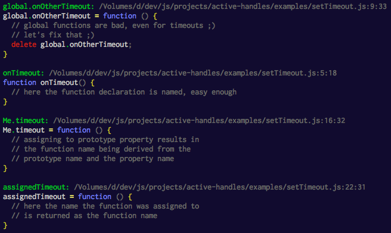

# active-handles [](http://travis-ci.org/thlorenz/active-handles)

Prints out information about the process's active handles, including function source and location.

```js
var activeHandles = require('active-handles');

function onTimeout() {
  // here the function declaration is named, easy enough
}

global.onOtherTimeout = function () {
  // global functions are bad, even for timeouts ;)
  // let's fix that ;)
  delete global.onOtherTimeout;
}

function Me() {}
Me.prototype.timeout = function () {
  // assigning to prototype property results in
  // the function name being derived from the
  // prototype name and the property name
}

var assignedTimeout = function () {
  // here the name the function was assigned to 
  // is returned as the function name
}

setTimeout(onTimeout, 10);
setTimeout(global.onOtherTimeout, 10);
setTimeout(new Me().timeout, 20);
setTimeout(assignedTimeout, 5);

activeHandles.print();
```



## Status

At this point gathers correct information for handles created via `setTimeout`.

`setInterval` handles are wrapped, so the wrapper function is returned instead - *working on improving that*.

## Installation

    npm install active-handles

## API

<!-- START docme generated API please keep comment here to allow auto update -->
<!-- DON'T EDIT THIS SECTION, INSTEAD RE-RUN docme TO UPDATE -->

<div>
<div class="jsdoc-githubify">
<section>
<article>
<div class="container-overview">
<dl class="details">
</dl>
</div>
<dl>
<dt>
<h4 class="name" id="activeHandles"><span class="type-signature"></span>activeHandles<span class="signature">()</span><span class="type-signature"> &rarr; {Array.&lt;Object>}</span></h4>
</dt>
<dd>
<div class="description">
<p>Gathers information about all currently active handles.
Active handles are obtained via <code>process._getActiveHandles</code>
and location and name of each is resolved.</p>
</div>
<dl class="details">
<dt class="tag-source">Source:</dt>
<dd class="tag-source"><ul class="dummy">
<li>
<a href="https://github.com/thlorenz/active-handles/blob/master/index.js">index.js</a>
<span>, </span>
<a href="https://github.com/thlorenz/active-handles/blob/master/index.js#L87">lineno 87</a>
</li>
</ul></dd>
</dl>
<h5>Returns:</h5>
<ul>
<li>
<div class="param-desc">
<p>handles each with the following properties</p>
</div>
<dl>
<dt>
Type
</dt>
<dd>
<span class="param-type">Array.&lt;Object></span>
</dd>
</dl>
</li>
<li>
<div class="param-desc">
<p>handle.msecs         timeout specified for the handle</p>
</div>
<dl>
<dt>
Type
</dt>
<dd>
<span class="param-type">Number</span>
</dd>
</dl>
</li>
<li>
<div class="param-desc">
<p>handle.fn            the handle itself</p>
</div>
<dl>
<dt>
Type
</dt>
<dd>
<span class="param-type">function</span>
</dd>
</dl>
</li>
<li>
<div class="param-desc">
<p>handle.name          the name of the function, for anonymous functions this is the name it was assigned to</p>
</div>
<dl>
<dt>
Type
</dt>
<dd>
<span class="param-type">String</span>
</dd>
</dl>
</li>
<li>
<div class="param-desc">
<p>handle.source        the raw function source</p>
</div>
<dl>
<dt>
Type
</dt>
<dd>
<span class="param-type">String</span>
</dd>
</dl>
</li>
<li>
<div class="param-desc">
<p>handle.highlighted   the highlighted source</p>
</div>
<dl>
<dt>
Type
</dt>
<dd>
<span class="param-type">String</span>
</dd>
</dl>
</li>
<li>
<div class="param-desc">
<p>handle.location      location information about the handle</p>
</div>
<dl>
<dt>
Type
</dt>
<dd>
<span class="param-type">Object</span>
</dd>
</dl>
</li>
<li>
<div class="param-desc">
<p>handle.location.file          full path to the file in which the handle was defined</p>
</div>
<dl>
<dt>
Type
</dt>
<dd>
<span class="param-type">String</span>
</dd>
</dl>
</li>
<li>
<div class="param-desc">
<p>handle.location.line          line where the handle was defined</p>
</div>
<dl>
<dt>
Type
</dt>
<dd>
<span class="param-type">Number</span>
</dd>
</dl>
</li>
<li>
<div class="param-desc">
<p>handle.location.column        column where the handle was defined</p>
</div>
<dl>
<dt>
Type
</dt>
<dd>
<span class="param-type">Number</span>
</dd>
</dl>
</li>
<li>
<div class="param-desc">
<p>handle.location.inferredName  name that is used when function declaration is anonymous</p>
</div>
<dl>
<dt>
Type
</dt>
<dd>
<span class="param-type">String</span>
</dd>
</dl>
</li>
</ul>
</dd>
<dt>
<h4 class="name" id="activeHandles::print"><span class="type-signature"></span>activeHandles::print<span class="signature">()</span><span class="type-signature"></span></h4>
</dt>
<dd>
<div class="description">
<p>Convenience function that first calls @see activeHandles and
prints the information to stdout.</p>
</div>
<dl class="details">
<dt class="tag-source">Source:</dt>
<dd class="tag-source"><ul class="dummy">
<li>
<a href="https://github.com/thlorenz/active-handles/blob/master/index.js">index.js</a>
<span>, </span>
<a href="https://github.com/thlorenz/active-handles/blob/master/index.js#L112">lineno 112</a>
</li>
</ul></dd>
</dl>
</dd>
</dl>
</article>
</section>
</div>

*generated with [docme](https://github.com/thlorenz/docme)*
</div>
<!-- END docme generated API please keep comment here to allow auto update -->

## License

MIT
