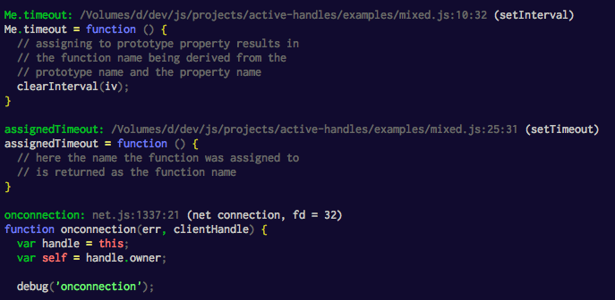

# active-handles [](http://travis-ci.org/thlorenz/active-handles)

Prints out information about the process's active handles, including function source and location.

```js
var activeHandles = require('active-handles');

// run your program, launch a server, call setTimeout or similar
// in order to create some handles and then call the below

activeHandles.print();
```



*Shows handles of multiple types created via
[examples/mixed.js](https://github.com/thlorenz/active-handles/blob/master/examples/mixed.js)*

## Installation

    npm install active-handles

## Caveats

For any version `<= v1.6.2` the `setInterval` function has to be hooked in order for this to work for `setInterval`
created handles.

In order to do that call `activeHandles.hookSetInterval()` **before** any calls to `setInterval` occurr. This is
demonstrated in [this example](https://github.com/thlorenz/active-handles/blob/master/examples/setInterval.js#L5).

Handles of `net` and `http` modules log handles from inside core *instead of your handle*, leaving you to hunt down
where you created these connections.

## API

<!-- START docme generated API please keep comment here to allow auto update -->
<!-- DON'T EDIT THIS SECTION, INSTEAD RE-RUN docme TO UPDATE -->

<div>
<div class="jsdoc-githubify">
<section>
<article>
<div class="container-overview">
<dl class="details">
</dl>
</div>
<dl>
<dt>
<h4 class="name" id="activeHandles"><span class="type-signature"></span>activeHandles<span class="signature">(options)</span><span class="type-signature"> &rarr; {Array.&lt;Object>}</span></h4>
</dt>
<dd>
<div class="description">
<p>Gathers information about all currently active handles.
Active handles are obtained via <code>process._getActiveHandles</code>
and location and name of each is resolved.</p>
</div>
<h5>Parameters:</h5>
<table class="params">
<thead>
<tr>
<th>Name</th>
<th>Type</th>
<th>Argument</th>
<th class="last">Description</th>
</tr>
</thead>
<tbody>
<tr>
<td class="name"><code>options</code></td>
<td class="type">
<span class="param-type">Object</span>
</td>
<td class="attributes">
</td>
<td class="description last"></td>
</tr>
<tr>
<td class="name"><code>opts.handles</code></td>
<td class="type">
<span class="param-type">Array.&lt;Object>=</span>
</td>
<td class="attributes">
&lt;optional><br>
</td>
<td class="description last"><p>handles to get info for (default: <code>process._getActiveHandles()</code>)</p></td>
</tr>
<tr>
<td class="name"><code>opts.source</code></td>
<td class="type">
<span class="param-type">Boolean</span>
</td>
<td class="attributes">
&lt;optional><br>
</td>
<td class="description last"><p>include source (default: <code>true</code>), included either way if <code>highlight=true</code></p></td>
</tr>
<tr>
<td class="name"><code>opts.highlight</code></td>
<td class="type">
<span class="param-type">Boolean</span>
</td>
<td class="attributes">
&lt;optional><br>
</td>
<td class="description last"><p>include highlighted source (default: <code>true</code>)</p></td>
</tr>
<tr>
<td class="name"><code>opts.attachHandle</code></td>
<td class="type">
<span class="param-type">Boolean</span>
</td>
<td class="attributes">
&lt;optional><br>
</td>
<td class="description last"><p>attaches inspected handle for further inspection (default: <code>false</code>)</p></td>
</tr>
</tbody>
</table>
<dl class="details">
<dt class="tag-source">Source:</dt>
<dd class="tag-source"><ul class="dummy">
<li>
<a href="https://github.com/thlorenz/active-handles/blob/master/index.js">index.js</a>
<span>, </span>
<a href="https://github.com/thlorenz/active-handles/blob/master/index.js#L33">lineno 33</a>
</li>
</ul></dd>
</dl>
<h5>Returns:</h5>
<ul>
<li>
<div class="param-desc">
<p>handles each with the following properties</p>
</div>
<dl>
<dt>
Type
</dt>
<dd>
<span class="param-type">Array.&lt;Object></span>
</dd>
</dl>
</li>
<li>
<div class="param-desc">
<p>handle.msecs         timeout specified for the handle</p>
</div>
<dl>
<dt>
Type
</dt>
<dd>
<span class="param-type">Number</span>
</dd>
</dl>
</li>
<li>
<div class="param-desc">
<p>handle.fn            the handle itself</p>
</div>
<dl>
<dt>
Type
</dt>
<dd>
<span class="param-type">function</span>
</dd>
</dl>
</li>
<li>
<div class="param-desc">
<p>handle.name          the name of the function, for anonymous functions this is the name it was assigned to</p>
</div>
<dl>
<dt>
Type
</dt>
<dd>
<span class="param-type">String</span>
</dd>
</dl>
</li>
<li>
<div class="param-desc">
<p>handle.anonymous     true if the function was anonymous</p>
</div>
<dl>
<dt>
Type
</dt>
<dd>
<span class="param-type">Boolean</span>
</dd>
</dl>
</li>
<li>
<div class="param-desc">
<p>handle.source        the raw function source</p>
</div>
<dl>
<dt>
Type
</dt>
<dd>
<span class="param-type">String</span>
</dd>
</dl>
</li>
<li>
<div class="param-desc">
<p>handle.highlighted   the highlighted source</p>
</div>
<dl>
<dt>
Type
</dt>
<dd>
<span class="param-type">String</span>
</dd>
</dl>
</li>
<li>
<div class="param-desc">
<p>handle.location      location information about the handle</p>
</div>
<dl>
<dt>
Type
</dt>
<dd>
<span class="param-type">Object</span>
</dd>
</dl>
</li>
<li>
<div class="param-desc">
<p>handle.location.file          full path to the file in which the handle was defined</p>
</div>
<dl>
<dt>
Type
</dt>
<dd>
<span class="param-type">String</span>
</dd>
</dl>
</li>
<li>
<div class="param-desc">
<p>handle.location.line          line where the handle was defined</p>
</div>
<dl>
<dt>
Type
</dt>
<dd>
<span class="param-type">Number</span>
</dd>
</dl>
</li>
<li>
<div class="param-desc">
<p>handle.location.column        column where the handle was defined</p>
</div>
<dl>
<dt>
Type
</dt>
<dd>
<span class="param-type">Number</span>
</dd>
</dl>
</li>
<li>
<div class="param-desc">
<p>handle.location.inferredName  name that is used when function declaration is anonymous</p>
</div>
<dl>
<dt>
Type
</dt>
<dd>
<span class="param-type">String</span>
</dd>
</dl>
</li>
</ul>
</dd>
<dt>
<h4 class="name" id="activeHandles::hookSetInterval"><span class="type-signature"></span>activeHandles::hookSetInterval<span class="signature">()</span><span class="type-signature"></span></h4>
</dt>
<dd>
<div class="description">
<p>Hooks <code>setInterval</code> calls in order to expose the passed handle.
NOTE: not needed in <code>io.js &gt;=v1.6.2</code> and will not hook for those versions.</p>
<p>The handle is wrapped. In older node versions it is not exposed.
The hooked version of <code>setInterval</code> will expose the wrapped callback
so its information can be retrieved later.</p>
</div>
<dl class="details">
<dt class="tag-source">Source:</dt>
<dd class="tag-source"><ul class="dummy">
<li>
<a href="https://github.com/thlorenz/active-handles/blob/master/index.js">index.js</a>
<span>, </span>
<a href="https://github.com/thlorenz/active-handles/blob/master/index.js#L110">lineno 110</a>
</li>
</ul></dd>
</dl>
</dd>
<dt>
<h4 class="name" id="activeHandles::print"><span class="type-signature"></span>activeHandles::print<span class="signature">(options)</span><span class="type-signature"></span></h4>
</dt>
<dd>
<div class="description">
<p>Convenience function that first calls @see activeHandles and
prints the information to stdout.</p>
</div>
<h5>Parameters:</h5>
<table class="params">
<thead>
<tr>
<th>Name</th>
<th>Type</th>
<th>Argument</th>
<th class="last">Description</th>
</tr>
</thead>
<tbody>
<tr>
<td class="name"><code>options</code></td>
<td class="type">
<span class="param-type">Object</span>
</td>
<td class="attributes">
</td>
<td class="description last"></td>
</tr>
<tr>
<td class="name"><code>opts.highlight</code></td>
<td class="type">
<span class="param-type">Boolean</span>
</td>
<td class="attributes">
&lt;optional><br>
</td>
<td class="description last"><p>print highlighted source (default: <code>true</code>)</p></td>
</tr>
</tbody>
</table>
<dl class="details">
<dt class="tag-source">Source:</dt>
<dd class="tag-source"><ul class="dummy">
<li>
<a href="https://github.com/thlorenz/active-handles/blob/master/index.js">index.js</a>
<span>, </span>
<a href="https://github.com/thlorenz/active-handles/blob/master/index.js#L66">lineno 66</a>
</li>
</ul></dd>
</dl>
</dd>
</dl>
</article>
</section>
</div>

*generated with [docme](https://github.com/thlorenz/docme)*
</div>
<!-- END docme generated API please keep comment here to allow auto update -->

## core

A core module which depends only on `function-origin` can be used. It behaves exactly like the main module except
that it doesn't merge `opts` with default options and provides **no highlighting** even if `highlight` is set in the options.
Additionally it does not include the `print` feature.

You can use it as follows:

```js
var activeHandles = require('active-handles/core');
activeHandles();
```

## License

MIT
